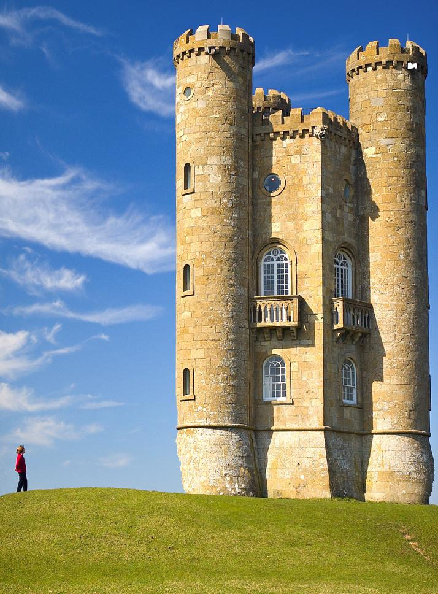
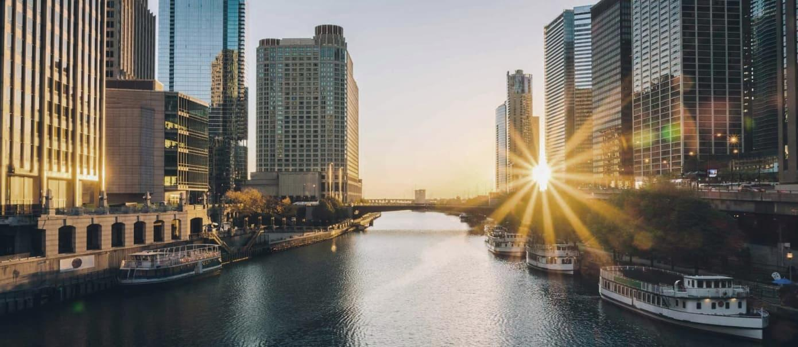

# seam_carving
Seam carving (or liquid rescaling) is an algorithm for content-aware image resizing
Useful examples and explanations: https://en.wikipedia.org/wiki/Seam_carving

# Examples
| Original                    | Seam Carved to 50% of original size |
| --------------------------- | ----------------------------------- |
|   |     |
|      |        |
|     |       |
|  |    |

# Usage
```bash
seam_carving image.ppm
```
```bash
usage: seam_carving <image>
    image   : a P3 ppm image
    # shrinks image to half
usage: seam_carving <image> <pixels>
    image   : a P3 ppm image
    pixels  : the number of pixels to remove
```

# Implementation Details

The program takes a ppm file (was easy for me to read to memory) and carves away vertical seams from it.

it uses a Image class that is parent to the gradient, the DPtable and the PPM image objects. it uses a thread pool from to calculate the gradients.

PPMimage reads the file and checks for errors in the file.
PPMimage then has a method called "delete_columns" that deletes a certain number of columns.
"delete_colums" creates a DPtable of values that represent the cost of the seams that can be removed
this dp table is filled by analyzing the gradient Image.
the creating of the gradient image is made with a thread pool of promises and futures.
then when the ppm objects receive the dp table it decides which seam to remove.
then reiterates till all the required seams have been deleted.

## FLAGS FOR COMPILATION
```bash
g++ -std=c++17 -Wall -pthread -O3
```

## HOW TO GET A PPM Image
I use convert from ImageMagick
``` bash
convert <source.extension> -compress none <destionation.ppm>
```

# Written by
Nicola Manzini